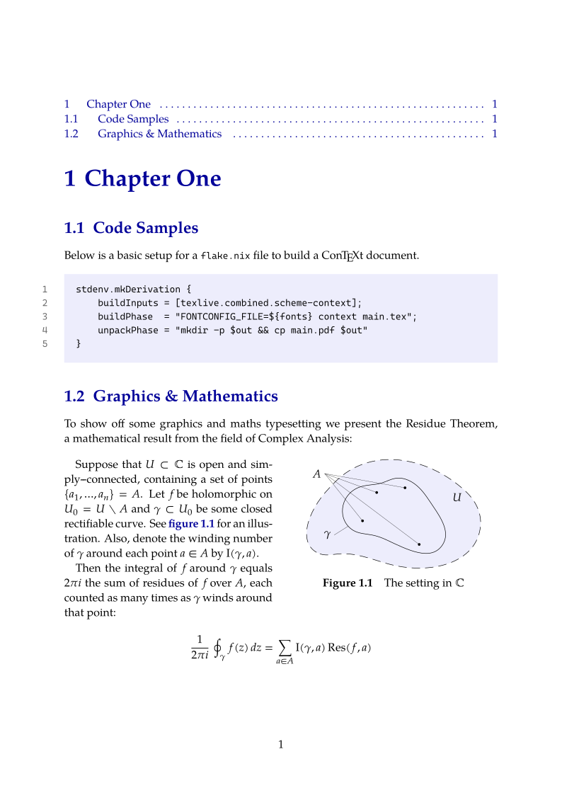

# Nix ConTeXt Example

## Intro

This repo is intended to provide a small example / to showcase how you can use
Nix to build a ConTeXt document. It aspires to be useful in two ways - to
help anyone with Nix installed more easily use ConTeXt (by means of example),
and to show a way for ConTeXt projects to be neatly packaged up with any
dependencies.

It also demonstrates the basics for how to perform a number of common tasks
in ConTeXt:

- how to add new fonts to a document (this is a point where Nix can
  really shine, by easing any pains around installing fonts)
- how to set options like page layout, paragraph indentation, etc.
- how to organize a project into multiple files using `environments`
- how to make nice graphics with MetaPost
- how to typeset code (although syntax highlighting is not handled)
- how to write maths the ConTeXt way, as opposed to the LaTeX way of
  acheiving the same things

## To Build

To try out building the document, thanks to nix, all need to do is run
`nix build github:rvLMdE7/nix-ConTeXt-example`. This will put the resulting
document at `./result/main.pdf`.

Alternatively, you can clone the repository in the standard way by running
`git clone https://github.com/rvLMdE7/nix-ConTeXt-example` and then run
`nix build`.

## Examine Inputs/Outputs

It is also possible to inspect this project:

- to show the outputs provided, run
  `nix flake show github:rvLMdE7/nix-ConTeXt-example`
- to show metadata & inputs required, run
  `nix flake show github:rvLMdE7/nix-ConTeXt-example`

## Images

Below is how the final document looks like:

